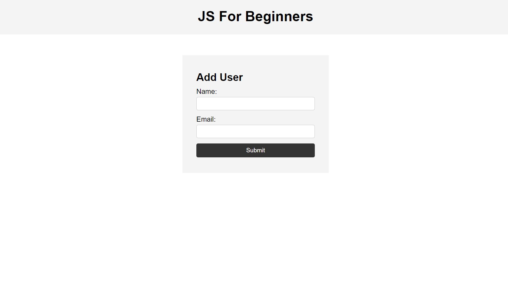

# User Form
 In this project, I build a basic form for a user to input name and email.



## Built With
- [HTML5](https://developer.mozilla.org/en-US/docs/Web/Guide/HTML/HTML5)
- [CSS3](https://developer.mozilla.org/en-US/docs/Web/CSS)
- [Javascript](https://developer.mozilla.org/en-US/docs/Web/JavaScript)

## Install
```
    $ git clone git@github.com:samiiexx/user-form.git
    $ cd main
```  
## Contributors
- Favour Samuel (@samiiexx)

## License
Copyright (c) 2021 Favour Samuel.

For enquiries please contact me at [sfchidimma@gmail.com](mailto:sfchidimma@gmail.com).